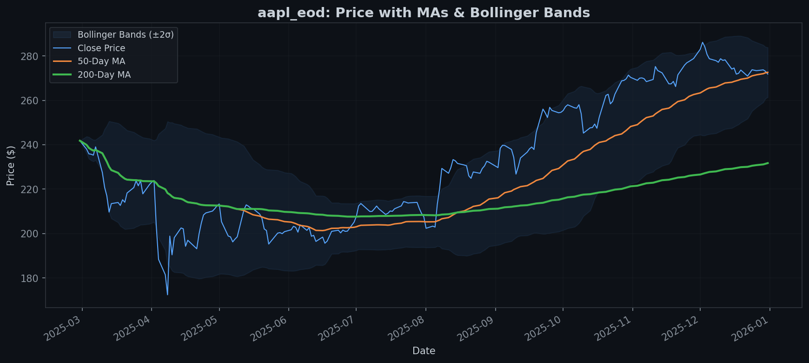
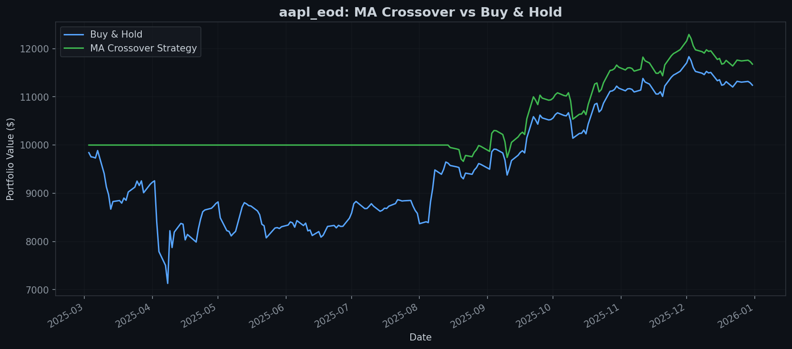
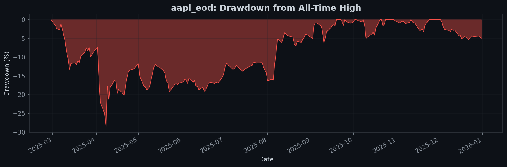
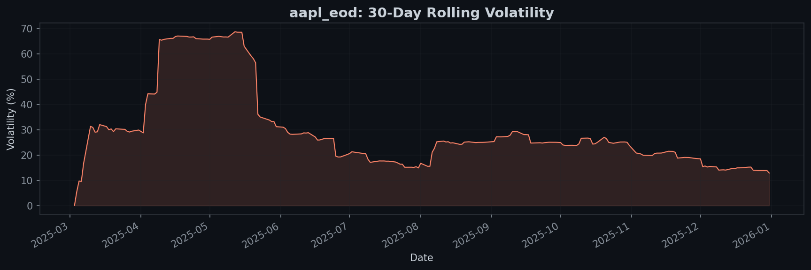
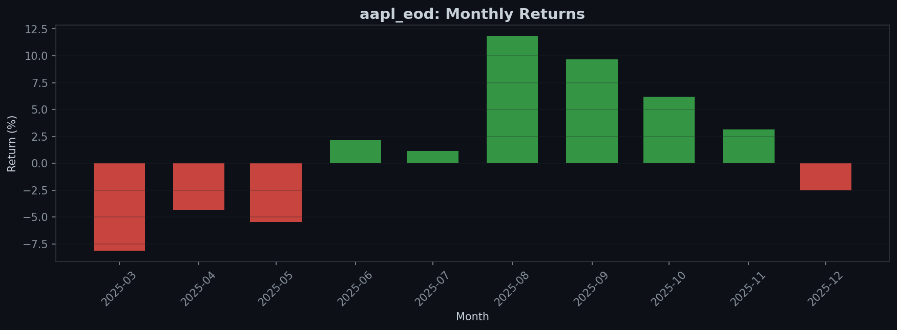
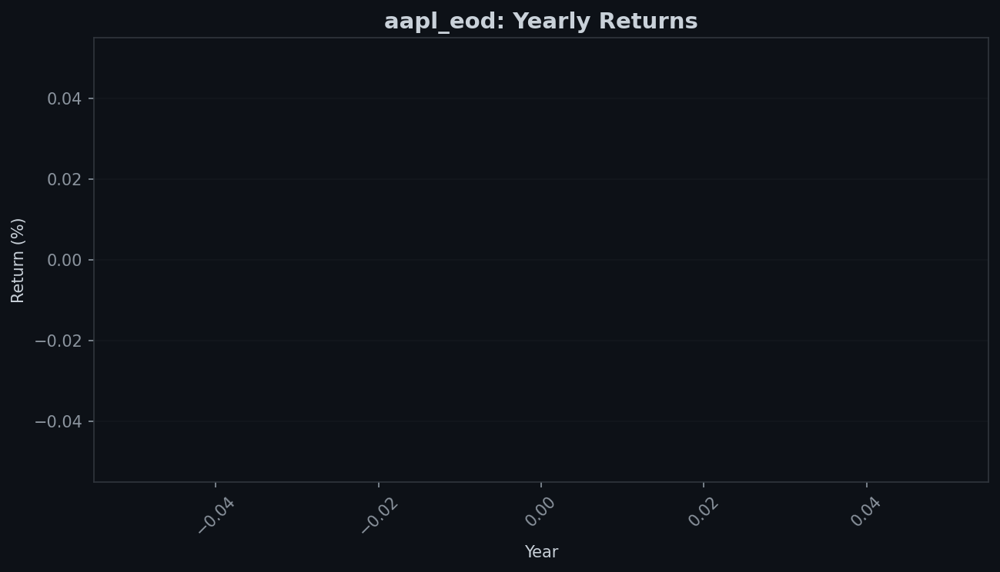

<p align="center">
  <h1 align="center">📈 findata-analytics</h1>
  <p align="center">
    <strong>Financial data pipeline & quantitative analytics with Python, DuckDB, and SQL</strong>
  </p>
  <p align="center">
    
    
    
    
  </p>
</p>

---

## 📋 Overview

An end-to-end financial analytics platform that generates or fetches financial data, stores it in DuckDB, runs SQL-native quantitative analysis using window functions and CTEs, backtests a trading strategy, and produces publication-quality charts — all from the command line.

---

## ⚡ Features

| Category | What It Does |
|----------|-------------|
| **Instant Demo** | Generate synthetic data → full analytics → charts in one command |
| **Real Data Pipeline** | Fetches EOD OHLCV data from EODHD for any ticker |
| **Synthetic Data Generator** | Realistic price series via Geometric Brownian Motion |
| **DuckDB Analytics** | 10 SQL analytics functions using window functions, CTEs, and LAG |
| **Performance Benchmarking** | Sequential (Pandas) vs parallel (PyArrow) ingestion |
| **MA Crossover Backtest** | Tests a 50/200-day moving average strategy vs buy-and-hold |
| **Visualization Suite** | 6 chart types with dark-mode styling |

---

## 🚀 Getting Started

### Step 1 · Install `uv`

> Skip if you already have it. Check with `uv --version`.

**macOS / Linux:**
```bash
curl -LsSf https://astral.sh/uv/install.sh | sh
```

**Windows:**
```powershell
powershell -ExecutionPolicy ByPass -c "irm https://astral.sh/uv/install.ps1 | iex"
```

### Step 2 · Run it

```bash
git clone https://github.com/Mnfisher93/findata-analytics.git && cd findata-analytics && uv run python main.py
```

**That's it.** Choose option **1** for an instant demo — no API key needed:

```
Choose a mode:

  [1]  🚀  Quick Demo        — Synthetic data → full analytics → charts (instant)
  [2]  📈  Real Market Data   — Fetch live data from EODHD API → analytics → charts
  [3]  📊  Analyze Existing   — Re-run analytics on data already in DuckDB

  [q]  Quit
```

> **Want real market data?** Choose option 2 — the program will prompt for your [EODHD API key](https://eodhd.com/register) (free tier available) and save it automatically.

---

## 🎯 Demo Output

### What Option 1 Produces

Generates 10 years of synthetic price data via **Geometric Brownian Motion**, then runs the full analytics pipeline:

- **Performance benchmarking** — sequential (Pandas) vs parallel (PyArrow + ProcessPoolExecutor)
- **10 SQL analytics** — daily returns, MAs, Bollinger Bands, rolling volatility, drawdown, monthly/yearly returns
- **MA crossover backtest** — 50/200-day strategy vs buy-and-hold ($10K starting capital)
- **6 publication-quality charts** saved to `output/`

---

## 🔬 SQL Analytics Engine

All quantitative analysis runs as **SQL queries directly inside DuckDB** — leveraging window functions, CTEs, and aggregation:

| Function | SQL Technique | What It Computes |
|----------|---------------|------------------|
| `daily_returns()` | `LAG()` window function | Day-over-day % change |
| `moving_averages()` | `AVG() OVER (ROWS BETWEEN)` | 50-day and 200-day MAs |
| `bollinger_bands()` | `STDDEV_POP() OVER ()` | ±2σ bands around 50-day MA |
| `cross_signals()` | `LAG()` + conditional logic | Golden Cross / Death Cross dates |
| `rolling_volatility()` | `STDDEV_POP() OVER ()` | 30-day annualized volatility |
| `max_drawdown()` | `MAX() OVER (UNBOUNDED)` | Running peak, drawdown % |
| `monthly_returns()` | CTEs + `LAG()` | Month-over-month returns |
| `yearly_returns()` | CTEs + `LAG()` | Year-over-year returns |
| `backtest_ma_crossover()` | `EXP(SUM(LN()))` | Strategy equity curve ($10K start) |
| `buy_and_hold()` | `EXP(SUM(LN()))` | Benchmark equity curve |

---

## 📊 Visualization

Charts use dark-mode styling and save to `output/`:

### Price with MAs & Bollinger Bands


### Equity Curves — Strategy vs Buy-and-Hold


### Drawdown from All-Time High


### 30-Day Rolling Volatility


### Monthly & Yearly Returns

| Monthly (color-coded) | Yearly (summary) |
|---|---|
|  |  |

---

## ⚙️ Performance: Sequential vs Parallel

The synthetic data generator supports two modes to demonstrate Python concurrency patterns:

| Mode | DataFrame | Concurrency | DuckDB Ingestion |
|------|-----------|-------------|------------------|
| Sequential | Pandas | Single-threaded | Copy (Pandas → Arrow internally) |
| Parallel | PyArrow | `ProcessPoolExecutor` (8 workers) | Zero-copy (Arrow-native) |

**Why it matters:** Python's GIL means threads share one CPU core for Python bytecode. `ProcessPoolExecutor` spawns **separate processes** — true parallelism for CPU-bound work. PyArrow tables are DuckDB's native format, eliminating data copy overhead.

---

## 🏗️ Architecture

```
                    ┌─────────────────────────────┐
                    │      main.py (interactive)   │
                    │   Menu → prompts → pipeline  │
                    └──────┬──────────┬────────────┘
                           │          │
              ┌────────────▼──┐  ┌────▼──────────────┐
              │ Data Pipeline │  │  Analytics Engine  │
              ├───────────────┤  ├────────────────────┤
              │ eodhd_client  │  │ queries.py         │
              │ synthetic.py  │  │ (10 SQL functions) │
              │ ingest.py     │  └────────┬───────────┘
              └───────┬───────┘           │
                      │                   │
              ┌───────▼───────────────────▼───┐
              │          DuckDB               │
              │    (findata.db — local file)   │
              └───────────────┬───────────────┘
                              │
                    ┌─────────▼─────────┐
                    │   visualize.py    │
                    │  (6 chart types)  │
                    └───────────────────┘
```

---

## 📦 Dependencies

| Package | Purpose |
|---------|---------|
| `duckdb` | Embedded analytical database |
| `eodhd` | EODHD financial data API client |
| `pandas` | Data manipulation and cleaning |
| `numpy` | Numerical computation (GBM simulation) |
| `pyarrow` | Zero-copy DuckDB ingestion |
| `matplotlib` | Chart generation |
| `python-dotenv` | Environment variable management |

---

## 🔗 Acknowledgements

Built from scratch, drawing concepts and inspiration from:

- [**financial-time-series-workshop**](https://github.com/tobalo/financial-time-series-workshop) by [@tobalo](https://github.com/tobalo) — DuckDB pipelines, GBM synthetic data, PyArrow zero-copy patterns
- [**SP500-Analytics-Project**](https://github.com/yjiang1003/SP500-Analytics-Project) by [@yjiang1003](https://github.com/yjiang1003) — SQL window functions, CTE patterns, MA crossover backtesting

---

## 📄 License

MIT
